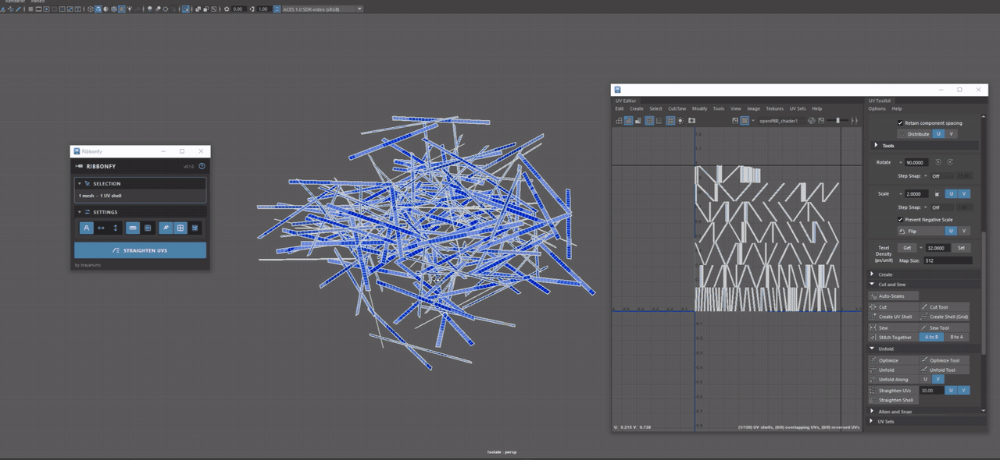
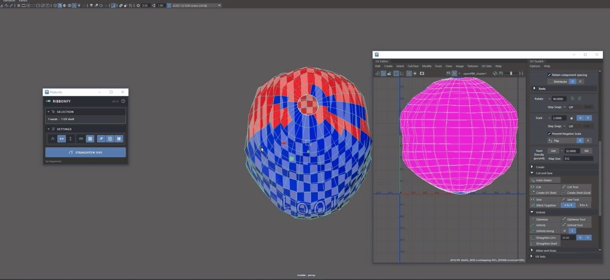

# Ribbonfy

One-click UV straightening for Maya. Select curved quad strips (pipes, cables, trims, belts) and turn them into straight, grid-aligned UV shells in one click.



## Features (v0.1)

- **One click, many shells.** Works on whole meshes, groups, or selected faces, UVs, edges or vertices, across several meshes at once.
- **Real proportions.** Rows and columns are spaced by averaged 3D edge lengths, so textures don't stretch. Uniform spacing is one toggle away.
- **Direction control.** Auto follows each shell's current layout; U or V forces the long side onto that axis.
- **Keeps your layout.** Texel density and shell position are preserved, and shells are never mirrored.
- **Closed rings.** Bands that wrap all the way around, like the open end of a pipe, are cut open along one line of edges and straightened in the same click. No history is added, and Ctrl+Z puts the seam back.
- **Safe.** Shells that aren't clean quad grids are skipped and listed with the reason; click one to select it. Fully undoable with Ctrl+Z.
- **Fast.** Bulk API reads and writes, one linear pass per shell. A 100,000-quad shell straightens in about 1.4 s; typical game strips take milliseconds.

It also works on organic shapes, like this head split into strip shells:



## Install

1. Unzip `ribbonfy-v0.1.0.zip` anywhere.
2. Drag `drag_to_install.mel` into the Maya viewport.

That's it. Ribbonfy copies itself into your Maya modules folder (`Documents/maya/modules/ribbonfy`), loads, and creates a **Ribbonfy** shelf with its button. Click the button to open the panel. It loads automatically every time Maya starts, and you can delete the unzipped folder afterwards.

To update, drag the new version's `drag_to_install.mel` in the same way; it replaces the old copy.

To uninstall, delete `Documents/maya/modules/ribbonfy` and `Documents/maya/modules/ribbonfy.mod`, then remove the Ribbonfy shelf (right-click the shelf tab > Delete Shelf).

Open the panel any time from the shelf, or with:

```python
import ribbonfy.ui; ribbonfy.ui.show()
```

Scripting:

```python
cmds.ribbonfy(direction="auto", spacing="edge", keepPosition=True, preserveDensity=True)
```

Tested on Maya [VERSIONS YOU TESTED]. Supports PySide2 (Maya 2022–2024) and PySide6 (Maya 2025+), no extra packages needed.

## How it works

1. **Validate.** The shell must be all quads with no interior poles. Anything else is skipped, never mangled.
2. **Grid walk.** The first face gets lattice corners (0,0), (1,0), (1,1), (0,1). A breadth-first walk crosses shared UV edges; each neighbour's two free corners land one lattice step beyond the shared edge, away from the face it came from. This works regardless of face winding. If a UV would land on two different lattice points, the shell is a closed loop or hides a pole, so it's skipped.
3. **Space.** Each lattice column gets the mean 3D length of the edges that span it (each row likewise). A running sum turns that into U and V.
4. **Orient.** The lattice axes are matched to how the shell currently runs in UV space, and the total signed area is checked so the result is never mirrored.
5. **Fit.** Scale to the original UV area (same texel density) and re-centre on the original bounds.

The math lives in `scripts/ribbonfy/core.py` with no Maya imports.

## Limitations

- Quad-grid shells only. Shells with triangles, n-gons or poles are skipped.
- Meshes with construction history: the panel asks whether to delete non-deformer history first (the `ribbonfy` command on its own skips them).
- Works on the current UV set.

## License

MIT. Made by Brayan Fernandez, [brayanuno.com](https://brayanuno.com).
